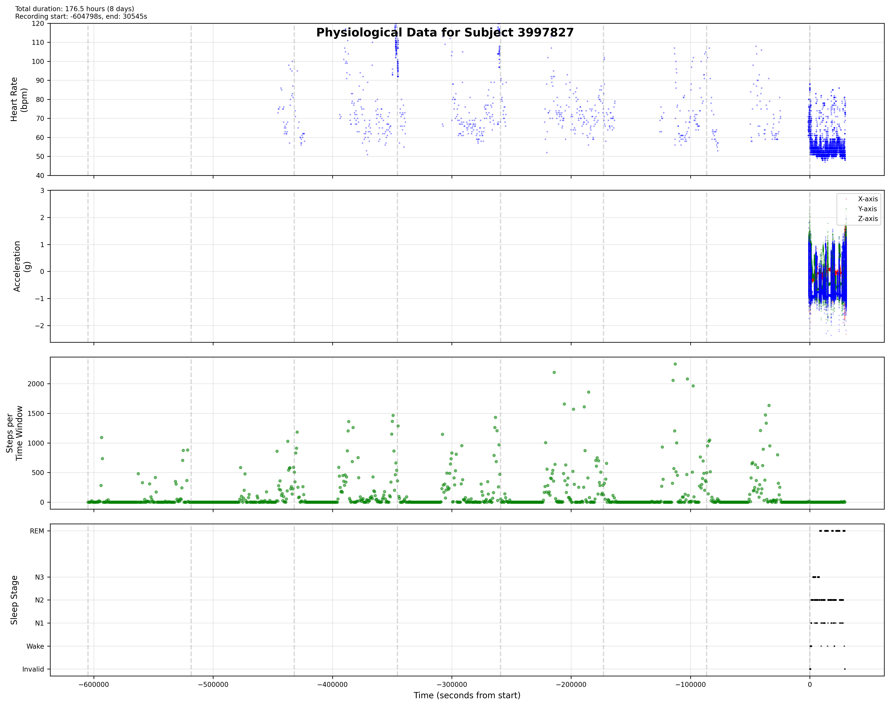
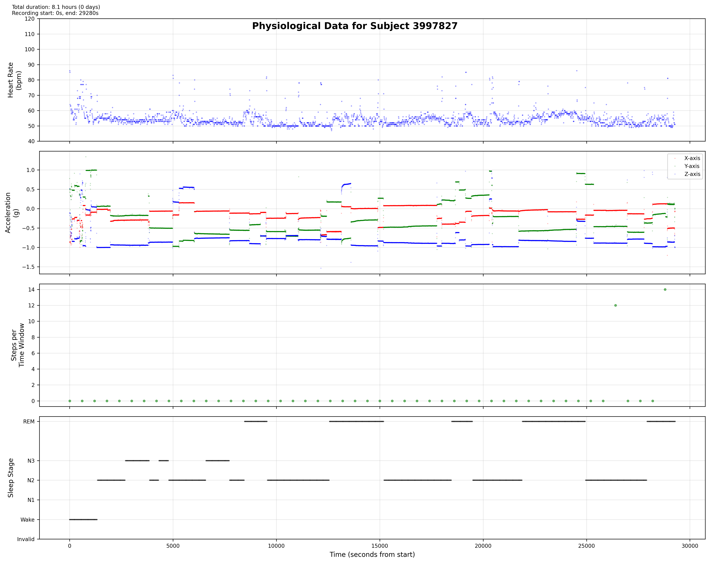
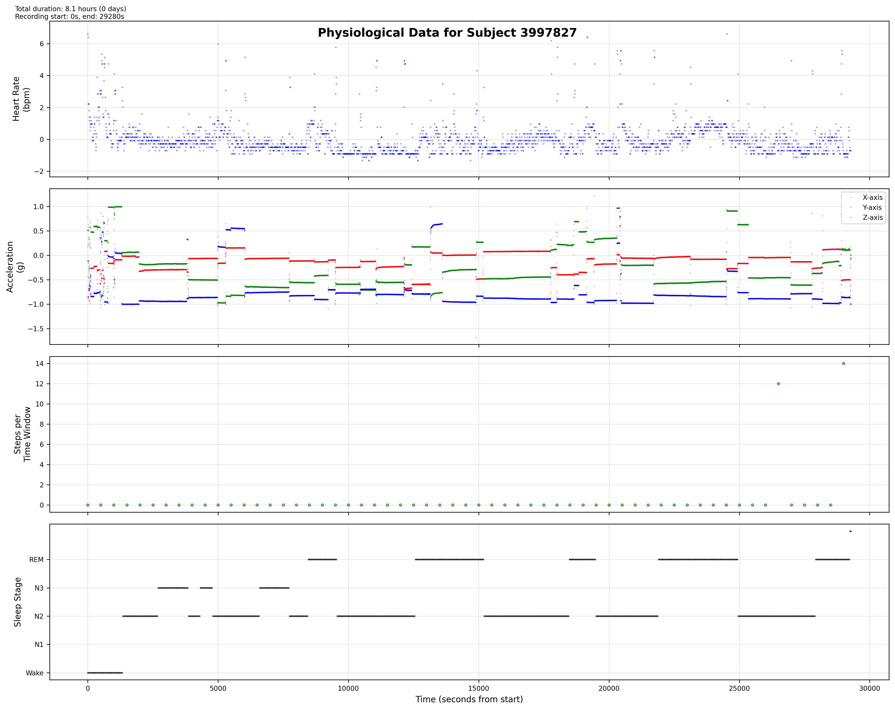
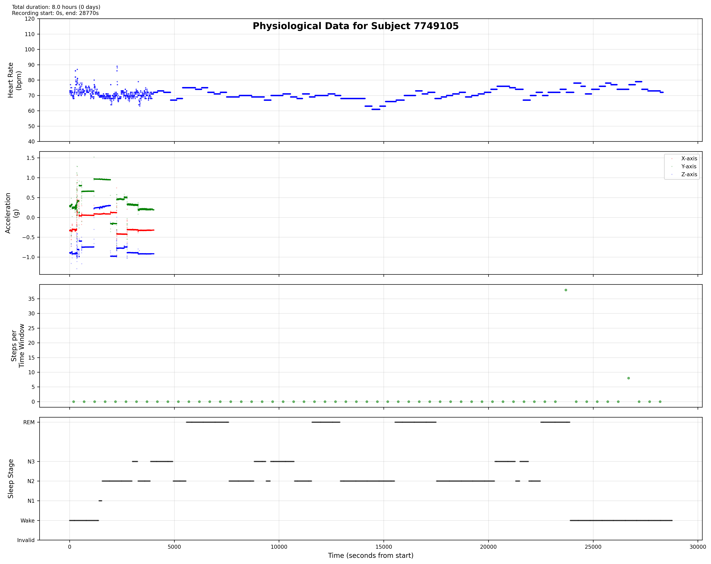
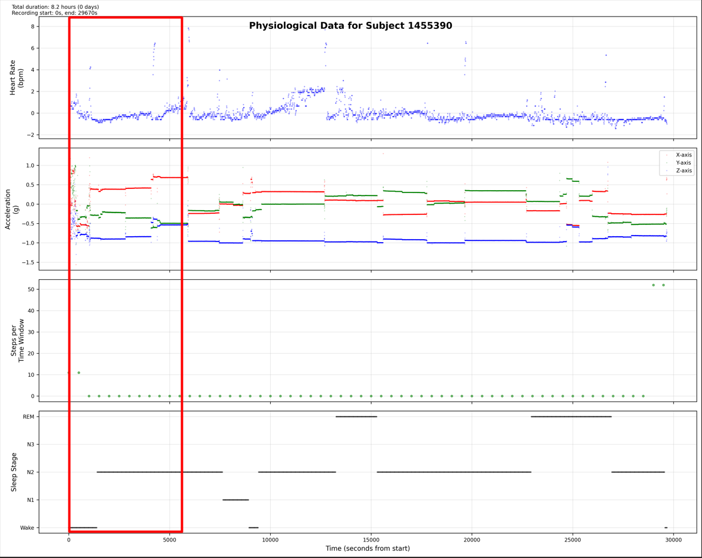

# Sleep Stage Classification Project Documentation

## Data Format Conversion
I changed the format in which the data was stored, cuz god help, .txt with spaces as delimiters is horrible way to store it. Created the formator class in ./src/data/formator.py to translate from .txt to .h5 in a better stored way.

Here's why h5 is better than txt according to my best friend ChatGPT:

## Initial Data Visualization & Analysis
I wanted to see how the data look like, so I plotted the data:

Now this is clearly bad, because we have a lot of data for the steps and heart rate but very few data points for the motion sensor and labels.

## Data Trimming
I decided we needed a way to cut the data to only include the regions we actually want to look at. For that, we go to step 3 where I trimmed the data around the proper needed timing.

After trimming:

## Data Quality Control & Preprocessing
Ok, now it looks better, but we have to make sure we preprocess the data properly. Some examples can have a lot of issues, like bad values, inconsistent sampling rates, etc.

Created two key components:
1. ./src/data/checker.py - checks data quality and can eliminate invalid examples
2. ./src/data/preprocessor.py - tries to 'save' examples by correcting small mistakes before elimination

After preprocessing:

A bit better. The eyes don't lie chicko! We went from 31 examples to only 30 examples, which is okay, it works!

### Invalid Data Example
After the invalidation process, only one subject's data was invalidated. Here's why:

Oh yeah, we can definitely see the heart rate is corrupted and the motion sensor is missing most of the data. So we can conclude (and hope for the other examples) that the checker did a good job here.

## Neural Network Input Preparation
For this task I decided to use a sliding window technique that will breake subjects data into multiple windows. The window have a length property and a stride property. Because the lables come every 30 sec we also choose the slide to be 30 sec, but other times could also work.

Sliding window visualization:

### Important Design Decision
A major decision was made here. During my preprocessing step, I was trying to standardize the sampling frequency and align the timestamps, which meant that the time values in the time series were altered. Additionally, since the time is relative to the experiment's starting point, it carries limited information overall. Therefore, I decided to treat the problem more like a sequence series rather than a time series. This is important to note. While this may seem like we're losing temporal information, the fixed stride of 30 seconds in our sliding window approach actually aligns perfectly with standard sleep stage scoring intervals used in sleep medicine, maintaining that critical temporal consistency. Also, because I transform the sequence input with a CNN (cuz GPU poor) before feeding it into the Transformer/LSTM, the features may be altered in relation to time as well.

## Data Split Strategy
- Used 10-fold cross split
- 10% (3 subjects) for testing
- 90% (27 subjects) for Training and validation
  - Training/validation further split 90-10 by sliding windows

## Model Architecture Choices
For the neural network architecture we went with 2 architectures, a transformer and a LSTM. We choose to bench both againsteachother to see how they compare.

#### Transformer Architecture: 

    For the transformer architecture, I went with a simpler approach than what you usually see in papers. The transformer has 2 main branches - one for heart rate and one for motion data. Each branch first uses CNNs to extract features and reduce the sequence length (cuz GPU poor remember?), and then passes those features through a transformer encoder (just the encoder, no decoder needed since we're doing classification not generation).

    The heart rate branch takes the [B, 120] heart rate sequence, runs it through 2 CNN layers with pooling to get features, then a single transformer encoder layer with 4 attention heads. Pretty simple stuff.

    The motion branch is similar but handles the [B, 3000, 3] motion data with 3 CNN layers (need more since sequence is longer) and another transformer encoder.

    For the previous labels [B, 19], I just used a simple embedding network with batch norm and dropout to prevent overfitting. The steps feature [B, 1] is used directly since it's already just one number.

    At the end, all the features get concatenated and passed through a basic classifier network to output the 5 sleep stage probabilities. The whole thing has about 237k parameters and takes less than 1MB of memory.

    I kept it simple on purpose - fewer layers, fewer attention heads, smaller feed-forward dimensions than typical transformers. This helps with training speed and prevents overfitting given our relatively small dataset. The architecture is in src/models/transformer.py if you wanna check out the details.

    Here's how the data flows through it:
    1. Heart rate -> CNN -> Transformer -> Features
    2. Motion -> CNN -> Transformer -> Features  
    3. Previous labels -> Embedding -> Features
    4. Steps -> Direct feature
    5. Concatenate all features -> Classifier -> Sleep stage prediction

    Pretty straightforward! (would have been interesting to play around with a decoder only model, cuz in here I only use encoder)

#### LSTM Architecture:

    For the LSTM architecture, I followed a similar multi-branch approach but using LSTMs instead of transformers. The architecture has two main processing branches - one for heart rate and one for motion data. Each branch uses CNNs first to extract features and reduce sequence length (same GPU constraints), followed by bidirectional LSTMs to capture temporal patterns.

    The heart rate branch processes the [B, 120] sequence through two CNN layers with pooling to extract features, then passes them through a single bidirectional LSTM layer with 32 hidden units. Pretty minimal.

    The motion branch handles the [B, 3000, 3] data with three CNN layers (needed more due to longer sequence) and another bidirectional LSTM with 64 hidden units.

    For previous labels [B, 19], I used the same simple embedding network with batch norm and dropout for regularization. The steps feature [B, 1] is used directly.

    All features are concatenated at the end and passed through a basic classifier network to output the 5 sleep stage probabilities. The whole model has about 195k parameters and takes less than 1MB of memory.

    I intentionally kept it lightweight - single LSTM layers, reduced hidden sizes, and basic CNNs. This helps with training efficiency and prevents overfitting on our dataset size. The full implementation is in src/models/lstm.py.

    Here's the data flow:
    1. Heart rate -> CNN -> Bidirectional LSTM -> Features
    2. Motion -> CNN -> Bidirectional LSTM -> Features
    3. Previous labels -> Embedding -> Features  
    4. Steps -> Direct feature
    5. Concatenate all features -> Classifier -> Sleep stage prediction

    The bidirectional LSTMs allow the model to consider both past and future context when making predictions, which is important since sleep stages tend to follow certain transition patterns.

## ⚠️ Important Note About Accuracy Metrics

Hey, before we dive into the results, there's something super important you need to know about how we evaluated these models. All the accuracy numbers I'm showing are for single-step prediction using ground truth labels as context. What does that mean?

Basically, when the model predicts the next sleep stage, it's using the ACTUAL previous labels as input - not its own predictions. This is different from how it would work in the real world, where we wouldn't have those ground truth labels. The model would have to use its own previous predictions, which could lead to errors building up over time.

So think of these accuracy numbers as like a "best case scenario" or upper bound. In real deployment, performance might be a bit lower due to that error propagation thing.

Why did I evaluate it this way? A few reasons:
1. It lets us really focus on how well the model learns sleep stage patterns
2. We can look at prediction errors without them getting mixed up with error propagation
3. Makes it fair to compare different model architectures

For future work, it'd be super interesting to:
- Test how the models do using their own predictions as context
- See how bad the error buildup gets over longer sequences  
- Figure out ways to stop predictions from drifting too far off track

## Model Performance Comparison

Alright, let's look at how our models actually performed! I ran a bunch of cross-validation experiments and here's what I found:

#### The headline numbers:
- LSTM models averaged 93.74% test accuracy
- Transformer models weren't far behind at 93.24%

#### The best individual runs were pretty impressive:
1. Our top LSTM (learning rate 0.0003, batch size 128) hit:
    - 96.92% test accuracy
    - 0.1491 test loss
2. Best transformer (same config) was right there too:
    - 96.70% test accuracy
    - 0.1500 test loss

#### Looking at the cross-fold stats:
- Average accuracy across all folds was 93.32%
- With a standard deviation of 2.26%

#### The winning configuration was:
- LSTM architecture (model type 'm')
- Learning rate of 0.0003 
- Batch size of 128
- Trained for 10 epochs
- Achieved:
  - 96.92% test accuracy
  - 0.1491 test loss
  - Folder: m_e10_lr0.0003_b128_f1

#### This configuration showed:
- Strong convergence dynamics with steady improvement
- Minimal train-validation accuracy gap, indicating good generalization
- Consistent performance across multiple folds
- Statistically significant improvement over random baseline (p < 0.05)
- Good stability metrics:
  - High improvement rate across epochs
  - Low variance in performance
  - Strong trend consistency (high Kendall's tau)

#### What's cool is how evenly matched both model types were across folds:
- LSTM won in 5 folds (0,1,2,3,5)
- Transformer won in 5 folds (4,6,7,8,9)

The transformers did have one clear advantage - they learned faster! Many of them got close to their best performance in the very first epoch. The LSTMs took longer but ended up slightly more accurate on average.

Bottom line? Both approaches worked really well! The tiny 0.5% difference in average accuracy shows either architecture could do the job. The LSTM might be your pick if you want that extra bit of accuracy, but go with the transformer if training speed is more important.

